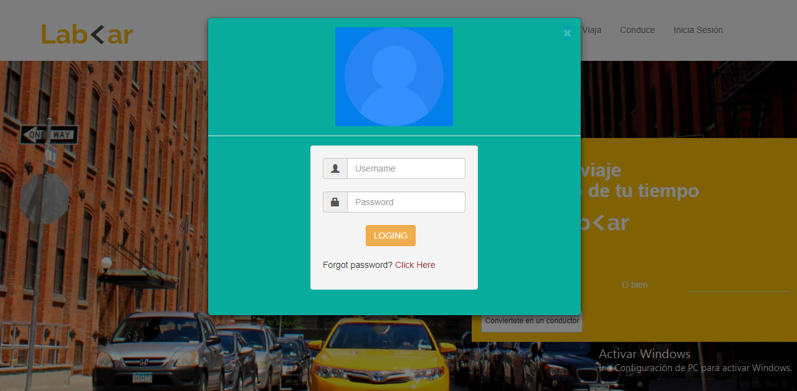

# RETO: Lab Car

* ### En el presente reto se nos pidió elaborar una página web para **LabCar**.

* ### El reto consiste en aplicar y practicar los conocimientos adquiridos sobre **Bootstrap v.3**.

* ### Esta fueron las imágenes proporcionadas por nuestros instructores para el desarrollo de la web:

> **Vista en Movil**

> **Vista en Desktop**

> **Modal de Inico de Sesión**

> **Modal de Registro**

> **Modal de Registro Conductor**

#### _Desarrollado por: Lucero Hospina_